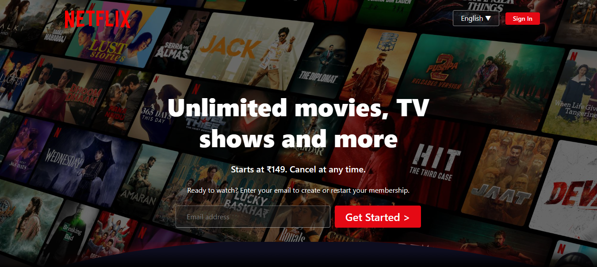
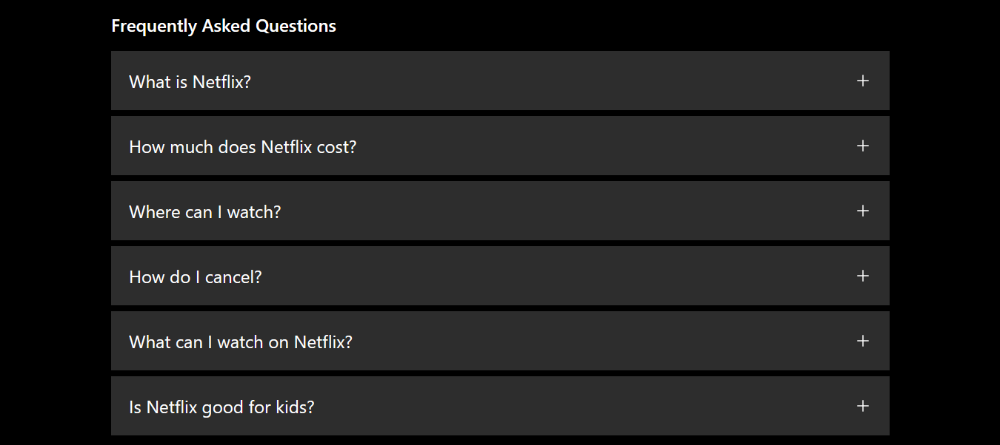

# 📺 Netflix Clone – HTML & CSS

This is a Netflix landing page clone built using only **HTML** and **CSS**. It recreates the visual style of Netflix’s homepage including a hero section, trending content cards, feature highlights, FAQ section, and footer.

### 🔗 Live Demo
👉 [View Live on Netlify](https://stream-clone-demo.netlify.app/)  

---

## 🚀 Features

- 🎨 Fully responsive layout
- 🖼️ Hero banner with call to action
- 🔥 Trending shows carousel
- 💡 Feature highlight section
- ❓ Interactive FAQ section
- 🦶 Complete footer with useful links

---

## 🛠️ Technologies Used

- HTML5
- CSS3 (Flexbox, Grid, Responsive Design)
- Google Fonts

---

## 📂 Folder Structure

```
netflix-clone/
├── index.html
├── style.css
├── README.md
└── ASSETS/
    ├── homepage.PNG
    ├── faq.png
    ├── bg.jpg
    ├── logo.svg
    ├── [other images and icons]
```

---

## 🖼️ Screenshots

### 🔹 Homepage


### 🔹 FAQ Section


---

## 📱 Responsive Design

Optimized for desktop, tablet, and mobile views using media queries. Smooth layout adjustments across devices.

---

## 📌 Credits

Design inspired by [Netflix India](https://www.netflix.com/in/).  
This is a personal educational project.

---

## 👤 Author

**[Your Name]**  
- [GitHub Profile](https://github.com/Shreya-nipunge)  
- [LinkedIn](https://linkedin.com/in/shreya-nipunge-a13a26321)  

---

> 🔄 Feel free to clone or fork this project and improve it further!
